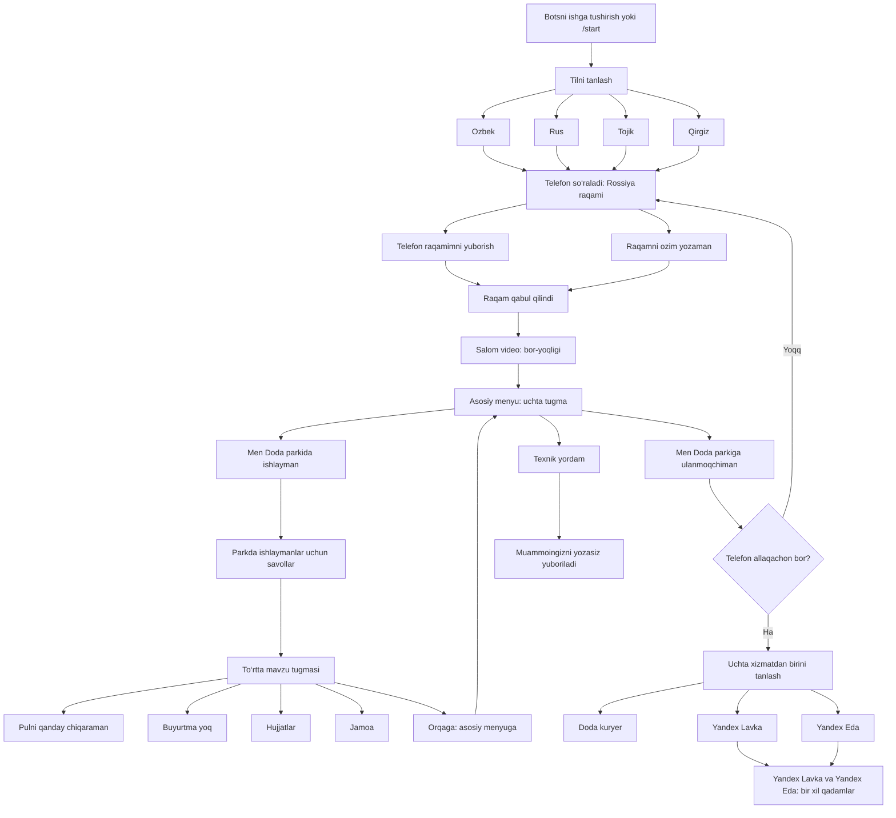
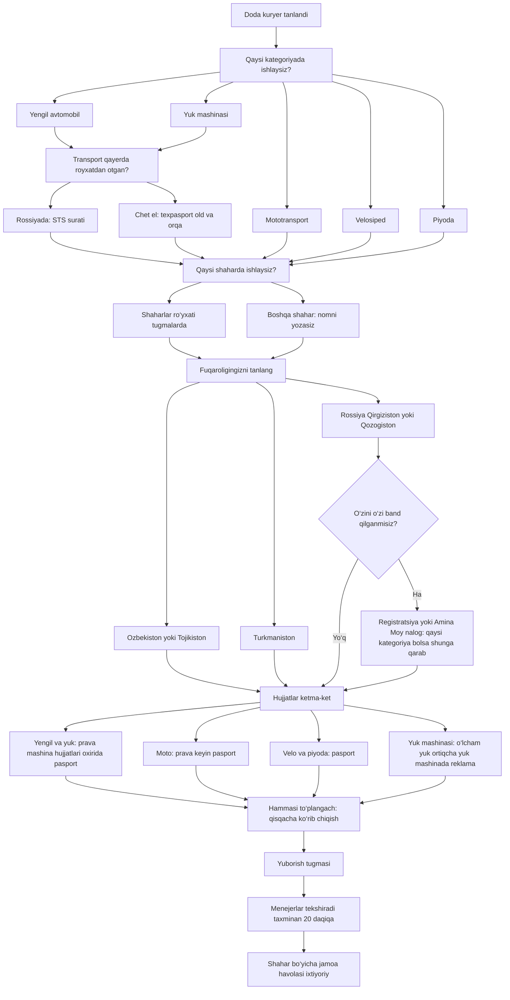
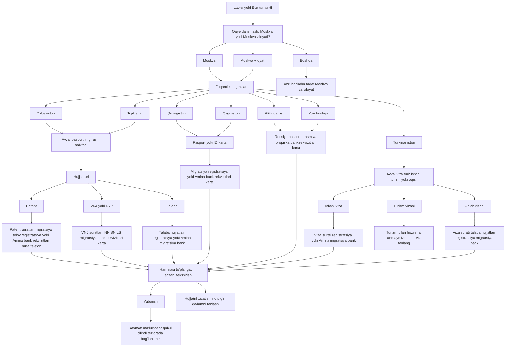

# Doda bot: tugmalar va yo‘llar (oddiy o‘zbekcha)

**Brauzerda to‘liq xarita (HTML + CSS, qorong‘i dizayn):** [bot-oqimi-map.html](bot-oqimi-map.html) — faylni mahalliy oching yoki `open docs/bot-oqimi-map.html`.

Bu yerda botni boshlashdan yakunigacha **qaysi tugmani bossangiz nima bo‘lishi** daraxt ko‘rinishida yozilgan. So‘zlar foydalanuvchi ekranidagi matnlarga yaqin; qisqa qilib tushuntirilgan.

> **Qanday ko‘rish:** GitHub yoki Cursor da faylni oching — diagrammalar avtomatik chiziladi. Oddiy matn muharririda `mermaid` bloklari ko‘rinmasi mumkin.

---

## 1. Boshlash: til, telefon, xush kelibsiz, asosiy menyu



---

## 2. «Doda kuryer» tarmog‘i — kategoriyadan hujjatlargacha



**Izohlar:**

- **O‘zbekiston** va **Tojikiston** tanlansa «o‘zini o‘zi band» savoli chiqmaydi; ketma-ketlik to‘g‘ridan-to‘g‘ri hujjatlarga o‘tadi.
- **Rossiya**, **Qirg‘iziston**, **Qozog‘iston** tanlansa «o‘zini o‘zi band» savoli beriladi; «ha» bo‘lsa qo‘shimcha suratlar va «Moy nalog» telefoni so‘ralishi mumkin.
- **Yengil** va **yuk** uchun avval mashina qayerda ro‘yxatdan o‘tgani so‘raladi; **moto**, **velo**, **piyoda** uchun bu savol yo‘q.
- **Velosiped** tanlansa ketma-ketlikda **termokorob bormi** degan savol ham chiqishi mumkin.
- Pastdagi to‘rt yo‘ldan **faqat bittasi** ishlaydi: qaysi kategoriyani tanlaganingizga qarab.
- Aniq qaysi surat keyin kelishi kategoriya va javoblarga bog‘liq; bot har bir qadamda bitta so‘raydi. **Davom etish** va **O‘zgartirish** tugmalari suratlar bilan birga chiqadi.

---

## 3. «Yandex Lavka» va «Yandex Eda» — bir xil yo‘l



---

## Qisqa xulosalar

- **Til** tanlangach darhol **telefon** so‘raladi, keyin **xush kelibsiz** va **asosiy menyu**.
- **Parkda ishlayman** — faqat savollar va javoblar; keyin yana asosiy menyuga qaytish mumkin.
- **Parkga ulanmoqchiman** — telefon bo‘lmasa avval telefon, keyin **Doda kuryer**, **Yandex Lavka** yoki **Yandex Eda**.
- **Lavka** va **Eda** — bir xil ketma-ketlik; farq faqat qaysi xizmatni tanlaganingizda saqlanadi.
- **Moskva / Moskva viloyati** dan boshqa joy tanlansa **xizmat berilmaydi** degan xabar chiqadi.

---

## Draw.io — skrinshotdagi kabi katta xarita

Tanlangan format: **diagrams.net (Draw.io)**. Loyihada `.drawio` fayl yaratish hozircha faqat **Agent** rejimida mumkin; siz esa quyidagi XML ni nusxalab `docs/BOT_OQIMI_UZ.drawio` nomi bilan saqlashingiz yoki [diagrams.net](https://app.diagrams.net/) da **File → Import from → Device** orqali yuklashingiz mumkin.

Xarita tuzilishi: **uchta katta swimlane** (Kirish, Doda kuryer, Yandex) va Yandex ichida **mamlakat bo‘yicha** kichik bloklar — siz yuborgan Figma/Miro namunasidagi guruhlashga yaqin.

<details>
<summary>XML ni ochish (bosib kengaytiring)</summary>

```xml
<mxfile host="app.diagrams.net" agent="cursor" version="22.1.0">
  <diagram id="botOqimiUz" name="Doda bot — oqim (o‘zbekcha)">
    <mxGraphModel dx="1400" dy="900" grid="1" gridSize="10" guides="1" tooltips="1" connect="1" arrows="1" fold="1" page="1" pageScale="1" pageWidth="2000" pageHeight="2800" math="0" shadow="0">
      <root>
        <mxCell id="0"/>
        <mxCell id="1" parent="0"/>
        <mxCell id="gKirish" value="1. Kirish va asosiy menyu" style="swimlane;horizontal=0;startSize=32;fillColor=#1a1a2e;fontColor=#ffffff;strokeColor=#4a4e69;" vertex="1" parent="1">
          <mxGeometry x="40" y="40" width="920" height="720" as="geometry"/>
        </mxCell>
        <mxCell id="nStart" value="Boshlash (/start)" style="rounded=1;whiteSpace=wrap;html=1;fillColor=#16213e;fontColor=#ffffff;strokeColor=#e94560;" vertex="1" parent="gKirish">
          <mxGeometry x="40" y="50" width="200" height="48" as="geometry"/>
        </mxCell>
        <mxCell id="nTil" value="Tilni tanlash&#xa;(O‘zbek / Rus / Tojik / Qirgiz)" style="rounded=1;whiteSpace=wrap;html=1;fillColor=#0f3460;fontColor=#ffffff;" vertex="1" parent="gKirish">
          <mxGeometry x="40" y="120" width="280" height="56" as="geometry"/>
        </mxCell>
        <mxCell id="nTel" value="Rossiya telefon raqami&#xa;«Yuborish» yoki «O‘zim yozaman»" style="rounded=1;whiteSpace=wrap;html=1;fillColor=#0f3460;fontColor=#ffffff;" vertex="1" parent="gKirish">
          <mxGeometry x="40" y="200" width="320" height="56" as="geometry"/>
        </mxCell>
        <mxCell id="nXush" value="Salom video (bor bo‘lsa) + xush kelibsiz" style="rounded=1;whiteSpace=wrap;html=1;fillColor=#0f3460;fontColor=#ffffff;" vertex="1" parent="gKirish">
          <mxGeometry x="40" y="280" width="360" height="48" as="geometry"/>
        </mxCell>
        <mxCell id="nAsosiy" value="Asosiy menyu — uchta tugma" style="rhombus;whiteSpace=wrap;html=1;fillColor=#533483;fontColor=#ffffff;" vertex="1" parent="gKirish">
          <mxGeometry x="40" y="360" width="280" height="100" as="geometry"/>
        </mxCell>
        <mxCell id="nPark" value="Doda parkida ishlayman → FAQ&#xa;+ Orqaga" style="rounded=1;whiteSpace=wrap;html=1;fillColor=#1f4068;fontColor=#ffffff;" vertex="1" parent="gKirish">
          <mxGeometry x="400" y="340" width="420" height="72" as="geometry"/>
        </mxCell>
        <mxCell id="nYordam" value="Texnik yordam → muammo yozish" style="rounded=1;whiteSpace=wrap;html=1;fillColor=#1f4068;fontColor=#ffffff;" vertex="1" parent="gKirish">
          <mxGeometry x="400" y="430" width="300" height="48" as="geometry"/>
        </mxCell>
        <mxCell id="nUlan" value="Parkga ulanmoqchiman&#xa;(telefon kerak bo‘lsa avval)" style="rounded=1;whiteSpace=wrap;html=1;fillColor=#1f4068;fontColor=#ffffff;" vertex="1" parent="gKirish">
          <mxGeometry x="400" y="500" width="380" height="56" as="geometry"/>
        </mxCell>
        <mxCell id="nXizmat" value="Xizmat tanlash" style="rhombus;whiteSpace=wrap;html=1;fillColor=#533483;fontColor=#ffffff;" vertex="1" parent="gKirish">
          <mxGeometry x="40" y="500" width="260" height="100" as="geometry"/>
        </mxCell>
        <mxCell id="nDodaBtn" value="Doda kuryer" style="rounded=1;whiteSpace=wrap;html=1;fillColor=#e94560;fontColor=#ffffff;" vertex="1" parent="gKirish">
          <mxGeometry x="40" y="630" width="140" height="40" as="geometry"/>
        </mxCell>
        <mxCell id="nLavka" value="Yandex Lavka" style="rounded=1;whiteSpace=wrap;html=1;fillColor=#e94560;fontColor=#ffffff;" vertex="1" parent="gKirish">
          <mxGeometry x="200" y="630" width="140" height="40" as="geometry"/>
        </mxCell>
        <mxCell id="nEda" value="Yandex Eda" style="rounded=1;whiteSpace=wrap;html=1;fillColor=#e94560;fontColor=#ffffff;" vertex="1" parent="gKirish">
          <mxGeometry x="360" y="630" width="140" height="40" as="geometry"/>
        </mxCell>
        <mxCell id="e1" style="edgeStyle=orthogonalEdgeStyle;strokeColor=#aaaaaa;" edge="1" parent="gKirish" source="nStart" target="nTil"><mxGeometry relative="1" as="geometry"/></mxCell>
        <mxCell id="e2" style="edgeStyle=orthogonalEdgeStyle;strokeColor=#aaaaaa;" edge="1" parent="gKirish" source="nTil" target="nTel"><mxGeometry relative="1" as="geometry"/></mxCell>
        <mxCell id="e3" style="edgeStyle=orthogonalEdgeStyle;strokeColor=#aaaaaa;" edge="1" parent="gKirish" source="nTel" target="nXush"><mxGeometry relative="1" as="geometry"/></mxCell>
        <mxCell id="e4" style="edgeStyle=orthogonalEdgeStyle;strokeColor=#aaaaaa;" edge="1" parent="gKirish" source="nXush" target="nAsosiy"><mxGeometry relative="1" as="geometry"/></mxCell>
        <mxCell id="e5" style="edgeStyle=orthogonalEdgeStyle;strokeColor=#aaaaaa;" edge="1" parent="gKirish" source="nAsosiy" target="nPark"><mxGeometry relative="1" as="geometry"/></mxCell>
        <mxCell id="e6" style="edgeStyle=orthogonalEdgeStyle;strokeColor=#aaaaaa;" edge="1" parent="gKirish" source="nAsosiy" target="nYordam"><mxGeometry relative="1" as="geometry"/></mxCell>
        <mxCell id="e7" style="edgeStyle=orthogonalEdgeStyle;strokeColor=#aaaaaa;" edge="1" parent="gKirish" source="nAsosiy" target="nUlan"><mxGeometry relative="1" as="geometry"/></mxCell>
        <mxCell id="e8" style="edgeStyle=orthogonalEdgeStyle;strokeColor=#aaaaaa;" edge="1" parent="gKirish" source="nUlan" target="nXizmat"><mxGeometry relative="1" as="geometry"/></mxCell>
        <mxCell id="e9" style="edgeStyle=orthogonalEdgeStyle;strokeColor=#aaaaaa;" edge="1" parent="gKirish" source="nXizmat" target="nDodaBtn"><mxGeometry relative="1" as="geometry"/></mxCell>
        <mxCell id="e10" style="edgeStyle=orthogonalEdgeStyle;strokeColor=#aaaaaa;" edge="1" parent="gKirish" source="nXizmat" target="nLavka"><mxGeometry relative="1" as="geometry"/></mxCell>
        <mxCell id="e11" style="edgeStyle=orthogonalEdgeStyle;strokeColor=#aaaaaa;" edge="1" parent="gKirish" source="nXizmat" target="nEda"><mxGeometry relative="1" as="geometry"/></mxCell>
        <mxCell id="gDoda" value="2. Doda kuryer" style="swimlane;horizontal=0;startSize=32;fillColor=#1a1a2e;fontColor=#ffffff;strokeColor=#4a4e69;" vertex="1" parent="1">
          <mxGeometry x="40" y="800" width="920" height="520" as="geometry"/>
        </mxCell>
        <mxCell id="dKat" value="Kategoriya → (yengil/yuk: mashina qayerda) → shahar → fuqarolik → (RF/KG/KZ: o‘zini o‘zi band) → hujjatlar → yuborish" style="rounded=1;whiteSpace=wrap;html=1;fillColor=#0f3460;fontColor=#ffffff;align=left;" vertex="1" parent="gDoda">
          <mxGeometry x="40" y="50" width="820" height="72" as="geometry"/>
        </mxCell>
        <mxCell id="gYx" value="3. Yandex Lavka / Eda — mamlakat bloklari" style="swimlane;horizontal=0;startSize=32;fillColor=#1a1a2e;fontColor=#ffffff;strokeColor=#4a4e69;" vertex="1" parent="1">
          <mxGeometry x="1000" y="40" width="920" height="700" as="geometry"/>
        </mxCell>
        <mxCell id="ySh" value="Moskva / Moskva viloyati / Boshqa" style="rounded=1;whiteSpace=wrap;html=1;fillColor=#0f3460;fontColor=#ffffff;" vertex="1" parent="gYx">
          <mxGeometry x="40" y="50" width="400" height="48" as="geometry"/>
        </mxCell>
        <mxCell id="yBlkUz" value="Hujjatlar — O‘zbekiston / Tojikiston" style="swimlane;horizontal=0;startSize=24;fillColor=#16213e;fontColor=#eeeeee;" vertex="1" parent="gYx">
          <mxGeometry x="40" y="130" width="820" height="120" as="geometry"/>
        </mxCell>
        <mxCell id="yBlkKz" value="Hujjatlar — Qozog‘iston / Qirg‘iziston" style="swimlane;horizontal=0;startSize=24;fillColor=#16213e;fontColor=#eeeeee;" vertex="1" parent="gYx">
          <mxGeometry x="40" y="280" width="820" height="100" as="geometry"/>
        </mxCell>
        <mxCell id="yBlkRf" value="Hujjatlar — RF / boshqa davlat" style="swimlane;horizontal=0;startSize=24;fillColor=#16213e;fontColor=#eeeeee;" vertex="1" parent="gYx">
          <mxGeometry x="40" y="410" width="820" height="90" as="geometry"/>
        </mxCell>
        <mxCell id="yBlkTm" value="Hujjatlar — Turkmaniston (viza turi → …)" style="swimlane;horizontal=0;startSize=24;fillColor=#16213e;fontColor=#eeeeee;" vertex="1" parent="gYx">
          <mxGeometry x="40" y="530" width="820" height="100" as="geometry"/>
        </mxCell>
        <mxCell id="yEnd" value="Yakun: tekshirish → Yuborish → raxmat" style="rounded=1;whiteSpace=wrap;html=1;fillColor=#e94560;fontColor=#ffffff;" vertex="1" parent="gYx">
          <mxGeometry x="40" y="660" width="400" height="44" as="geometry"/>
        </mxCell>
      </root>
    </mxGraphModel>
  </diagram>
</mxfile>
```

</details>

*Bu fayl loyihadagi bot matnlari va qadamlar bilan mos kelishi uchun vaqti-vaqti bilan yangilanadi.*
