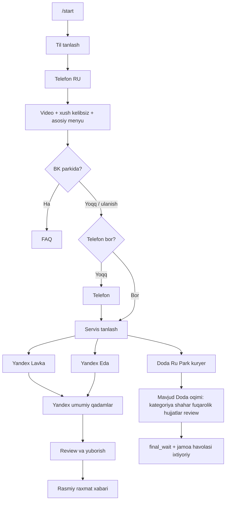

# BK-bot: onboarding — yakuniy TZ va ketma-ketlik

Bu hujjat botdagi ro‘yxatdan o‘tish oqimining **joriy** implementatsiyasiga mos keladi (asosiy kod: [`src/bk/handlers.js`](../src/bk/handlers.js), Doda hujjatlari: [`src/flow.js`](../src/flow.js), Yandex: [`src/bk/yandexFlow.js`](../src/bk/yandexFlow.js), [`src/bk/yandexHandlers.js`](../src/bk/yandexHandlers.js)).

## Umumiy diagramma (mermaid)

## Ketma-ketlik qoidalari

1. **Til** tanlangandan keyin darhol **telefon** so‘raladi; keyin **xush kelibsiz** (video bo‘lsa) va **asosiy menyu**.
2. **«Parkda emasman»**: telefon bo‘lmasa — avval telefon, so‘ng **servis tanlash**; telefon bo‘lsa — to‘g‘ridan-to‘g‘ri **servis tanlash** (Doda / Lavka / Eda).
3. **Doda** tarmog‘i o‘zgartirilmagan: barcha qadamlar [`dodaDocSequence`](../src/flow.js) va [`handlers.js`](../src/bk/handlers.js) bo‘yicha.
4. **Yandex Lavka va Yandex Eda** bir xil qadam ketma-ketligi: shahar → fuqarolik / status → tarmoq bo‘yicha hujjatlar → rekvizitlar (video, foto, matn, karta, telefon) → **ko‘rib chiqish** → yuborish. **Turkmaniston** TZ bo‘yicha: avval pasport surati, keyin viza turi (tugmalar), keyin viza surati, so‘ng reg/Amina → migratsiya kartasi → telefon → rekvizitlar.
5. **Til** `user_profiles.language` da saqlanadi; matnlar `tBK` orqali tanlangan tilda chiqadi.
6. **Yandex** yuborilgandan keyin foydalanuvchiga **rasmiy** yakuniy matn (`yx_final_thanks`): ma’lumotlar qabul qilindi, tez orada bog‘lanamiz.

## Guruhga xabar

- Doda to‘liq ariza: `notifyGroupFullSubmission` ([`src/services/groupInbox.js`](../src/services/groupInbox.js)).
- Yandex (Lavka/Eda): `notifyGroupYandexSubmission` — `yx_*` fayllar `completed_yx` tartibida, matn maydonlari alohida blokda.

## Muhim session_state qiymatlari

| State | Ma’nosi |
|--------|---------|
| `bk_lang` | Til kutilyapti |
| `bk_phone` | Telefon |
| `bk_main` | Asosiy menyu |
| `bk_service` | Servis tanlash (Doda / Lavka / Eda) |
| `bk_category` … `bk_review` | Doda (o‘zgarishsiz) |
| `bk_yx` | Yandex qadamlari |
| `bk_yx_review` | Yandex yakuniy ko‘rib chiqish |
| `done` | Yuborilgan |
